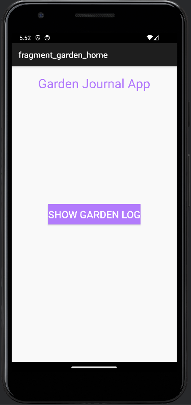
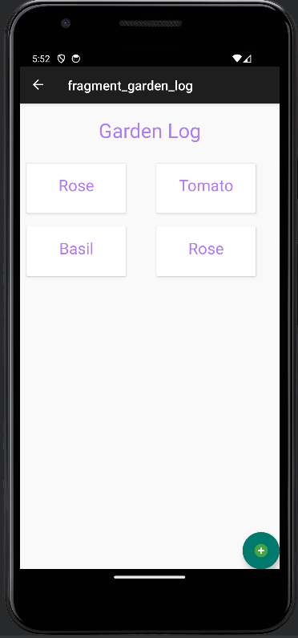
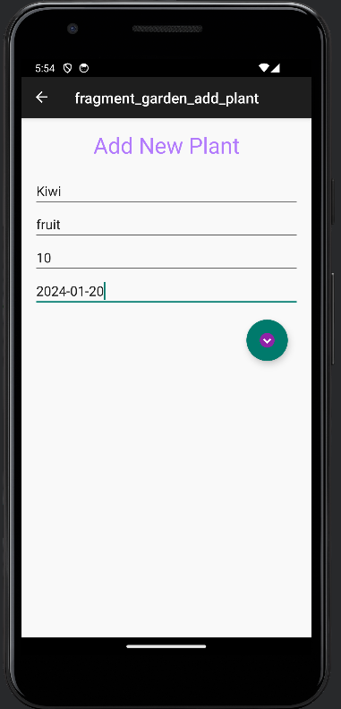
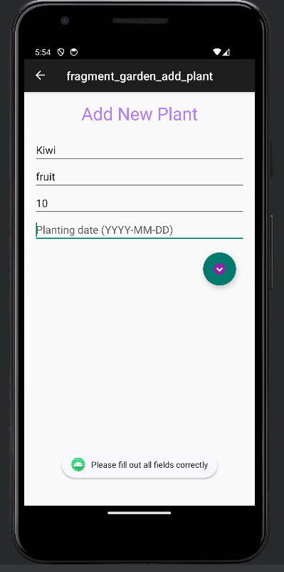
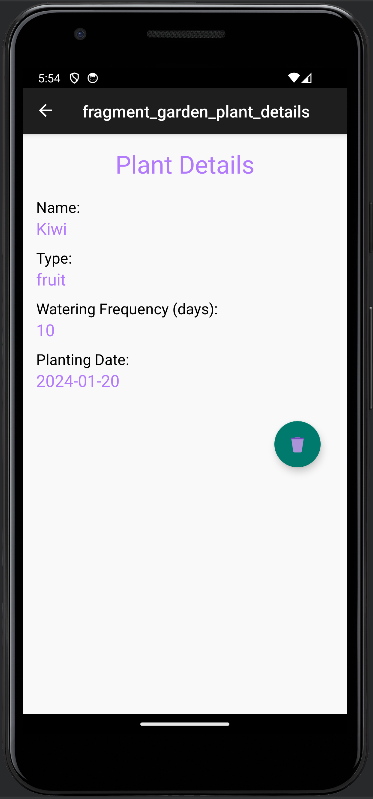

# gardening-journal-app

- [gardening-journal-app](#gardening-journal-app)
  - [Screenshots](#screenshots)
  - [How to Build and Run](#how-to-build-and-run)
  - [Features](#features)
    - [Navigation Structure](#navigation-structure)
    - [ViewModel and LiveData](#viewmodel-and-livedata)
    - [Room Database](#room-database)
    - [Coroutines](#coroutines)
    - [Garden Log Screen](#garden-log-screen)
    - [Plant Details Screen](#plant-details-screen)

The Gardening Journal App is a feature-rich Android application designed for gardening enthusiasts to track and manage their plants.

This app, developed using Kotlin, showcases the integration of modern Android development practices and libraries, including ViewModel, LiveData, Navigation component, Room database, and coroutines.

## Screenshots

## How to Build and Run

To build and run the Gardening Journal App, follow these steps:

- Clone the repository from GitHub to your local machine.
- Open the project in Android Studio.
- Ensure that you have the latest Kotlin plugin and Android SDK installed.
- Build the project in Android Studio by selecting Build -> Make Project.
- Run the app on an emulator or physical device by selecting Run -> Run 'app'.

## Features

### Navigation Structure

- Home Screen: The landing screen of the app.
- Garden Log Screen: Displays a list of all plants added by the user. Users can navigate to add new plants or view plant details.
- Plant Details Screen: Shows detailed information about a specific plant selected from the Garden Log.

### ViewModel and LiveData

- Each screen has its own ViewModel to manage UI-related data efficiently.
- LiveData is used to observe data changes and update the UI reactively.
- The app ensures that ViewModels survive configuration changes like screen rotations.

### Room Database

- A Room database is implemented to store and manage plant data.
- The Plant entity class includes attributes like name, type, watering frequency, and planting date.
- Data Access Object (DAO) is used for database operations, ensuring efficient data management.

### Coroutines

- Coroutines handle asynchronous operations such as database queries, ensuring smooth UI performance.
- Database operations are executed on background threads, preventing any blockage of the main thread.

### Garden Log Screen

- A RecyclerView is used to display the list of plants.
- Users can add new plants to the database. The insertion into the database is handled asynchronously using coroutines.

### Plant Details Screen

- Detailed information of a selected plant is displayed.
- Plant details are fetched from the database using the plant's ID passed via navigation arguments.
